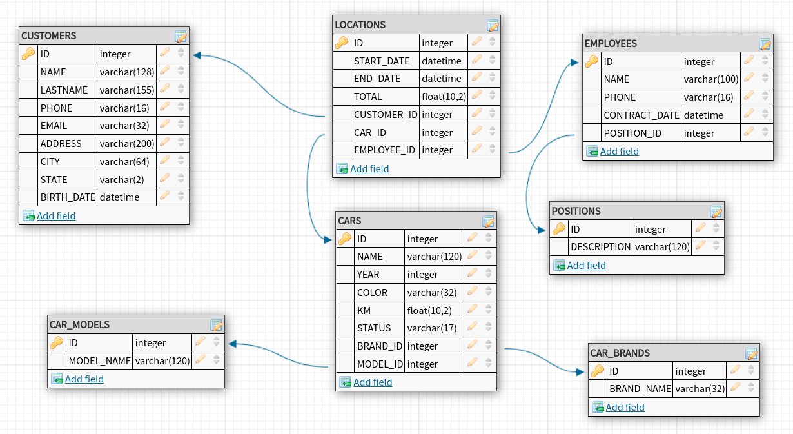

## Introdução
O projeto visa construir um banco de dados real para uma empresa de locação de veículos. Durante a execução deste desafio, você terá a oportunidade de praticar e aperfeiçoar todas as habilidades que foram adquiridas durante o curso Manipulando dados com SQL - Uma abordagem rápida e prática.

Como nosso foco é praticar a linguagem SQL, será disponibilizado o diagrama do banco de dados com todas as tabelas, atributos e chaves já definidas para que você foque somente na construção do projeto. Embora existam outras ferramentas e banco de dados, é recomendável que você utilize o banco de dados SQLite e o Visual Studio Code conforme foi apresentado durante as aulas.

## Resumo do Projeto
Nosso projeto será construir um banco de dados responsável por gerenciar dados de uma empresa do ramo de locação de veículos. O banco de dados deve ser capaz de armazenar dados tanto dos clientes, funcionários e cargos existentes, como também os modelos, as marcas, os automóveis e as informações das locações realizadas pelos clientes da empresa.

Este desafio é composto por várias tarefas em uma ordem planejada e algumas tarefas possuem dependência com alguma tarefa anterior. Sendo assim, é necessário que você resolva cada tarefa seguindo a ordem sugerida. Ao final de cada tarefa esperamos que você inclua em seu repositório Git os arquivos SQL necessários para concluir a tarefa. Você pode criar quantos arquivos SQL quiser de acordo com sua organização, mas pedimos que mantenha sempre uma identificação da tarefa referente a cada arquivo. Recomendamos a criação de subpastas ou o uso de um identificador no nome de cada arquivo.

Ao final de todo o trabalho, este é o banco de dados que esperamos que você tenha construído:

__Importante__: este desafio pretende te ajudar na consolidação de conhecimentos e, ao mesmo tempo, permitir que nossa equipe acompanhe sua evolução técnica. Por isso, é uma atividade individual e pedimos a gentileza de não compartilhar com outras pessoas participantes. No entanto, você ainda pode tirar dúvidas sobre o conteúdo do curso no canal da turma no Mattermost.

Tarefas
1. Crie o banco de dados no SQlite com nome dbRentalcar
2. Construa uma query SQL para criar a tabela CUSTOMERS (Clientes) no banco de dados, e logo em seguida insira os clientes abaixo:

| ID | NAME    | LASTNAME | PHONE   | EMAIL              | ADDRESS              | CITY          | STATE | BIRTH_DATE |
|----|---------|----------|---------|--------------------|----------------------|---------------|-------|------------|
| 1  |Roberto  |Silva     |(11) 964 |roberto@gmail.com   |Rua José, 32          |São Roque      |SP     |1987-04-25  |
| 2  |Maria    |Gomes     |(11) 974 |maria@yahoo.com     |Rua das Flores, 44    |São Paulo      |SP     |1988-03-24  |
| 3  |Renata   |Antunes   |(11) 974 |renata@hotmail.com  |Rua dos Antunes, 55   |Sorocaba       |SP     |1970-05-01  |
| 4  |Josefa   |Duarte    |(11) 973 |josefa20@gmail.com  |Rua dos Flocos, 387   |Mairinque      |SP     |1988-06-18  |
| 5  |André    |Linares   |(11) 975 |andre.lin@gmail.com |Rua Palmeiras, 3      |Rio de Janeiro |RJ     |2000-11-04  |
| 6  |Mário    |Santana   |(11) 974 |mario@gmail.com     |Rua das Rosas, 8      |Salvador       |BA     |1999-12-15  |
| 7  |Luis     |Duarte    |(11) 987 |luis@hotmail.com    |Rua das Orquidias, 18 |Fortaleza      |CE     |1985-07-06  |
| 8  |Dalva    |Malheiros |(11) 966 |dalva@gmail.com     |Rua das Nogueiras, 12 |São Paulo      |SP     |1956-08-03  |
| 9  |Carolina |Medeiros  |(11) 935 |carol@ig.com.br     |Rua dos Jatobás, 1    |Cajamar        |SP     |1974-08-21  |
| 10 |Marcos   |Rodrigues |(11) 972 |marcos@uol.com.br   |Rua das Amazonas, 89  |Recife         |PE     |1966-05-25  |

3. Construa uma query SQL para criar a tabela CAR_MODEL (modelos) no banco de dados, e logo em seguida insira os modelos abaixo:

| ID | MODEL_NAME |
|----|------------|
| 1  |Conversível |
| 2  |Sedã        |
| 3  |Hatch       |
| 4  |Coupé       |
| 5  |Perua       |
| 6  |SUV         |
| 7  |Picape      |
| 8  |Minivan     |
| 9  |Utilitário  |
| 10 |Buggy       |

4. Construa uma query SQL para criar a tabela CAR_BRAND (marcas) no banco de dados, e logo em seguida insira as marcas abaixo:

| ID | BRAND_NAME |
|----|------------|
| 1  |Chevrolet   |
| 2  |Toyota      |
| 3  |Hyundai     |
| 4  |Volkswagen  |
| 5  |Jeep        |
| 6  |Renault     |
| 7  |Honda       |
| 8  |Fiat        |

5. Construa uma query SQL para criar a tabela POSITIONS (Cargos) no banco de dados, e logo em seguida insira os cargos abaixo:

| ID | DESCRIPTION              |
|----|--------------------------|
| 1  |Gerente de vendas         |
| 2  |	Gerente de compras      |
| 3  |Vendedor                  |
| 4  |Mecânico                  |
| 5  |Assistente Administrativo |

6. Construa uma query SQL para criar a tabela EMPLOYEES (Funcionários) no banco de dados, e logo em seguida insira os funcionários abaixo:

| ID | NAME          | PHONE          | CONTRACT_DATE | POSITION_ID |
|----|---------------|----------------|---------------|-------------|
| 1  |Adriana Lemes  |(11) 98789-9999 |10/04/2021     |1            |
| 2  |Camila Soares  |(11) 92749-9599 |25/03/2008     |3            |
| 3  |Leonardo Silva |(11) 91449-9600 |26/08/2018     |5            |
| 4  |Mayara Gomes   |(11) 92649-9601 |18/07/2016     |2            |
| 5  |Matheus Alves  |(11) 92749-9602 |04/03/2015     |5            |
| 6  |Aline Santos   |(11) 99789-3135 |06/05/2020     |3            |

7. Construa uma query SQL para criar a tabela CARS (Carros) no banco de dados, e logo em seguida insira os automóveis abaixo:

| ID | NAME             | YEAR | COLOR | KM    | STATUS      | BRAND_ID | MODEL_ID |
|----|------------------|------|-------|-------|-------------|----------|----------|
| 1  |Chevrolet Onix LT |2016  |Preto  |8000   |Liberado     |1         |3         |
| 2  |Hyundai HB20 1.6  |2022  |Prata  |3000   |Em manutenção|3         |3         |
| 3  |Toyota Yaris      |2021  |Branca |10000  |Liberado     |2         |3         |
| 4  |Fiat Cronos       |2022  |Preto  |2500   |Liberado     |8         |2         |
| 5  |Honda HR-V        |2018  |Prata  |40000  |Em manutenção|7         |6         |
| 6  |VW Amarok         |2019  |Prata  |25000  |Liberado     |4         |6         |

8. Construa uma query SQL para criar a tabela LOCATIONS (Locações) no banco de dados, e logo em seguida insira as locações abaixo:

| ID | START_DATE | END_DATE  | TOTAL | CUSTOMER_ID| CAR_ID | EMPLOYEE_ID |
|----|------------|-----------|-------|------------|--------|-------------|
| 1  |2021-04-01  |2021-04-07 |1500   |1           |1       |2            |
| 2  |2022-05-20  |2022-05-30 |1800   |2           |1       |5            |
| 3  |2021-03-10  |2021-03-21 |2500   |5           |6       |5            |
| 4  |2018-02-20  |2018-03-05 |1250   |6           |4       |6            |
| 5  |2022-11-20  |2022-11-29 |900    |1           |3       |2            |
| 6  |2019-10-01  |2019-10-29 |2800   |3           |1       |6            |

9. Construa uma query SQL para editar o campo e-mail do cliente com nome Carolina, onde devemos trocar de “carol@ig.com.br” para “carolina@campuscode.com.br”.
10. Construa uma query SQL para editar a data de nascimento do cliente com nome Josefa para “1986-06-19”.
11. Construa uma query SQL para editar o ano do automóvel com nome Fiat Cronos de “2022” para “2019” da tabela de CARS
12. Construa uma query SQL para excluir o automóvel com nome Hyundai HB20 1.6 da tabela de CARS
13. Construa uma query SQL para alterar o nome da coluna “PHONE” da tabela de EMPLOYEES, para “PHONE NUMBER”
14. Construa uma consulta capaz de exibir somente o name, lastname e email dos clientes que moram no estado de SP
15. Construa uma consulta capaz de exibir somente os automóveis que estão com o status “Liberado”
16. Construa uma consulta capaz de exibir todos os automóveis do ano 2016.
17. Construa uma consulta capaz de exibir todos os funcionários e seus respectivos cargos
18. Construa uma consulta capaz de exibir somente os funcionários que realizaram mais ou igual a 2 locações.
19. Construa uma consulta capaz de exibir somente os clientes que realizaram mais ou igual a 2 locações.
20. Construa uma consulta capaz de exibir todas as locações realizadas, assim como também o nome do cliente, do automóvel e do funcionário vinculados em cada locação
21. Construa uma consulta capaz de exibir quantas locações existem na tabela de LOCATIONS
22. Construa uma consulta capaz de exibir qual foi a locação com o TOTAL com maior valor.
23. Construa uma consulta capaz de exibir todas as locações realizadas, entre as datas “2022-05-20” a “2022-12-25”